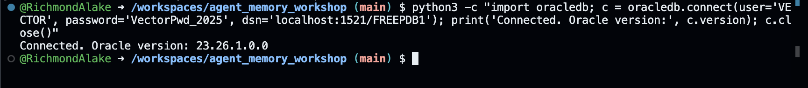

# From RAG to Agents Workshop

**Build a complete RAG pipeline and agentic system with Oracle AI Database, OpenAI, and the Agents SDK**

[](https://codespaces.new/YOUR-ORG/from-rag-to-agents-workshop)

---

## What You Will Build

Starting from raw data, you will construct:

1. **5 Retrieval Strategies** — keyword, vector, hybrid (pre-filter, post-filter, RRF), and graph-based retrieval, all running natively in Oracle
2. **End-to-End RAG Pipeline** — retrieve evidence from Oracle, format context, and generate grounded answers with OpenAI
3. **AI Agents with Tools** — wrap Oracle retrieval as callable tools using the OpenAI Agents SDK
4. **Multi-Agent Orchestration** — compose specialist agents (research retriever, conversation retriever, orchestrator, synthesizer) into a production-like workflow
5. **Persistent Session Memory** — build an `OracleSession` adapter for durable, queryable conversation memory

## Workshop Parts

| Part | Topic | Guide |
|------|-------|-------|
| 1 | Oracle AI Database Setup & Connection | [Part 1 Guide](docs/part-1-oracle-setup.md) |
| 2 | Data Loading & Embedding Generation | [Part 2 Guide](docs/part-2-data-loading.md) |
| 3 | Database Table Setup & Data Ingestion | [Part 3 Guide](docs/part-3-table-setup.md) |
| 4 | Retrieval Mechanisms (keyword, vector, hybrid, graph) | [Part 4 Guide](docs/part-4-retrieval.md) |
| 5 | Building a RAG Pipeline | [Part 5 Guide](docs/part-5-rag-pipeline.md) |
| 6 | AI Agents — Basics & Tools | [Part 6 Guide](docs/part-6-agents-basics.md) |
| 7 | Agent Orchestration & Chat System | [Part 7 Guide](docs/part-7-orchestration.md) |
| 8 | Session Memory with Oracle AI Database | [Part 8 Guide](docs/part-8-session-memory.md) |

## Getting Started

### Option A: GitHub Codespaces (recommended for the workshop)

1. Click the **Open in GitHub Codespaces** badge above
2. Wait for the environment to build (~3-5 minutes)

   

3. Once the terminal prompt appears, start Oracle AI Database:

   > **Tip:** If your browser prompts you to allow clipboard pasting, click **Allow** so you can paste commands into the terminal.

   ```bash
   docker compose -f .devcontainer/docker-compose.yml up -d oracle
   ```

   

4. Wait for Oracle to become healthy (~60-90 seconds), then verify:
   ```bash
   docker ps
   ```
   You should see `(healthy)` in the STATUS column for the `oracle-free` container.

   

5. Confirm the Python connection works:
   ```bash
   python3 -c "import oracledb; c = oracledb.connect(user='VECTOR', password='VectorPwd_2025', dsn='localhost:1521/FREEPDB1'); print('Connected. Oracle version:', c.version); c.close()"
   ```

   

6. Open [`workshop/notebook_student.ipynb`](workshop/notebook_student.ipynb) in the file explorer
7. Select the **Python 3** kernel from the top-right kernel picker
8. Follow the notebook cells top to bottom, using the part guides in `docs/` when you hit a TODO

You will need:
- A GitHub account (free)
- An OpenAI API key — needed from Part 5 onwards

> **Note:** On subsequent Codespace opens, Oracle should start automatically via `postStartCommand`. If you ever see a connection error in the notebook, run step 3 above again from the terminal.

### Option B: Local development

```bash
git clone https://github.com/YOUR-ORG/from-rag-to-agents-workshop
cd from-rag-to-agents-workshop

# Start Oracle AI Database
docker compose -f .devcontainer/docker-compose.yml up -d oracle

# Install dependencies
pip install -r requirements.txt

# Wait ~2 minutes for Oracle, then configure vector memory
docker exec oracle-free bash -c \
  "echo 'ALTER SYSTEM SET vector_memory_size=512M SCOPE=SPFILE;' | \
   sqlplus -s sys/OraclePwd_2025@localhost:1521/FREE as sysdba"
docker restart oracle-free

# Launch Jupyter
jupyter lab workshop/notebook_student.ipynb
```

Wait approximately 2 minutes for Oracle to initialise before running notebook cells.

## Workshop Files

```
from_rag_to_agents_workshop/
├── .devcontainer/
│   ├── devcontainer.json      Codespaces configuration
│   ├── docker-compose.yml     Oracle container definition
│   └── setup.sh               Dependency installation and Oracle health check
├── workshop/
│   ├── notebook_student.ipynb   Your working notebook (contains TODO gaps)
│   └── notebook_complete.ipynb  Complete reference (do not open until done)
├── docs/
│   ├── part-1-oracle-setup.md
│   ├── part-2-data-loading.md
│   ├── part-3-table-setup.md
│   ├── part-4-retrieval.md
│   ├── part-5-rag-pipeline.md
│   ├── part-6-agents-basics.md
│   ├── part-7-orchestration.md
│   └── part-8-session-memory.md
├── images/
├── requirements.txt
└── README.md
```

## Stack

- Oracle AI Database via `gvenzl/oracle-free:23-slim`
- `sentence-transformers` — local embedding model (nomic-embed-text-v1.5, 768-dim)
- `oracledb` — Python Oracle driver
- `OpenAI API` — LLM generation (GPT-4o)
- `openai-agents` — Agent SDK (Agent, Runner, function_tool, orchestration)

---

Built for the Oracle AI Developer Experience team.
